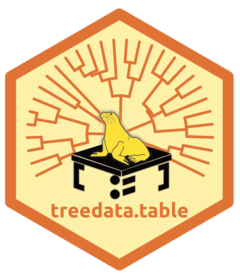
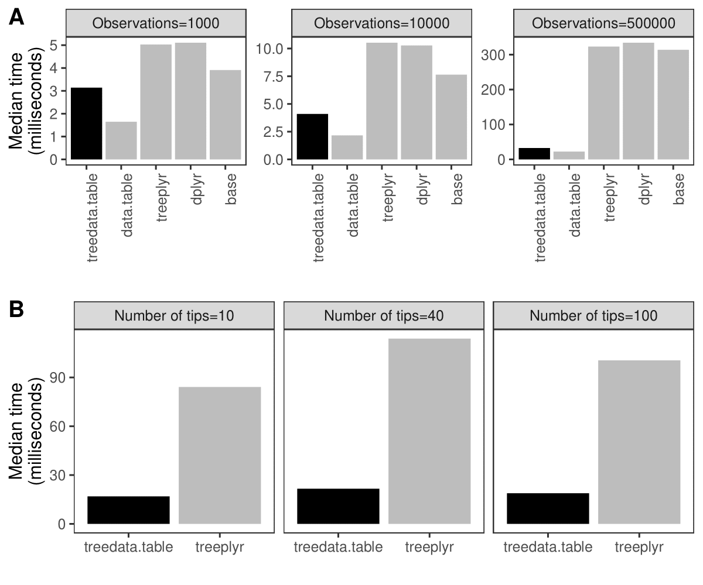

# treedata.table

## An R package for manipulating phylogenetic data with *data.table*

A wrapper for data.table that enables fast manipulation of phylogenetic
trees matched to data. 

The [`data.table` package](https://github.com/Rdatatable/data.table)
enables high-performance extended functionality for data tables in R.
`treedata.table` is a wrapper for `data.table` for phylogenetic analyses
that matches a phylogeny to the data.table, and preserves matching
during `data.table` operations.

### tl;dr

`treedata.table` is a library for syncing data between a dataset and the
tips of trees to enable efficient data and taxon management, as well as
on-the-fly indexing and data selection in comparative analyses.

## Why use `treedata.table`?

Simultaneous processing of phylogenetic trees and data remains a
computationally-intensive task. For example, processing a dataset of
phylogenetic characters alongside a tree in `treedata.table` takes
**90%** longer than processing the data alone in `data.table` (*Fig.
1A*). `treedata.table` provides new tools for increasing the speed and
efficiency of phylogenetic data processing. Data manipulation in
`treedata.table` is significantly faster than in other commonly used
packages such as `base` (**\>35%**), `treeplyr` (**\>60%**), and `dplyr`
(**\>90%**). Additionally, `treedata.table` is **\>400%** faster than
`treeplyr` during the initial data/tree matching step (*Fig. 1B*).



**Fig. 1.** Results for the `treedata.table` microbenchmark during
(**A**) data manipulation (`treedata.table[`) and (**B**) tree/data
matching steps. We compare the performance of `treedata.table` against
`treedata.table`, `base`, `treeplyr`, and `dplyr` using the
`microbenchmark` R package.

## Installing `treedata.table`

treedata.table can be installed from CRAN or GitHub at the present. We
presently recommend installing using
[`remotes`](https://cran.r-project.org/web/packages/remotes/index.html)
if using the GitHib version:

``` r

install.packages("treedata.table")
remotes::install_github("ropensci/treedata.table")
library(treedata.table)
```

## What Can I Do With `treedata.table`?

`treedata.table` is designed with the intention of being able to
efficiently manipulate trait data and phylogenetic trees to enable
comparative analyses. With the package is bundled some example data.
Let’s load it in and look at some common analyses.

``` r

data(anolis)
td <- as.treedata.table(tree = anolis$phy, data = anolis$dat)
```

The function `as.treedata.table` converts a normal comma- or
tab-delimited file to the `data.table`
[format](https://cran.r-project.org/web/packages/data.table/vignettes/datatable-intro.html).
This enables a range of efficient and intuitive indexing and selection
operations.

Now, we’re going to use the `tdt` and `extractVector` functions in
`data.table`. As an example, in our dataset is the column `SVL`, or
snout-to-vent length in our anoles. We can index out this column on the
fly, and run a Brownian motion analysis on this trait using the R
package Geiger:

``` r

tdt(td, geiger::fitContinuous(phy, extractVector(td, 'SVL'), model="BM", ncores=1))
```

We can also do efficient dropping of taxa from the analysis like so:

``` r

dt <- droptreedata.table(tdObject=td, taxa=c("chamaeleonides" ,"eugenegrahami" ))
```

## Additional resources

More details about the functions implemented in `treedata.table` can be
found in the different vignettes associated with the package or in our
[website](https://ropensci.github.io/treedata.table/).

## Contributing

Please see our [contributing
guide](https://docs.ropensci.org/treedata.table/CONTRIBUTING).

## Contact

Please see the package
[DESCRIPTION](https://docs.ropensci.org/treedata.table/DESCRIPTION) for
package authors.

## Citation

Please use the following citation when using the package:

*Josef Uyeda, Cristian Román-Palacios, and April Wright (2021).
treedata.table: Manipulation of Matched Phylogenies and Data using
‘data.table’. Available at:
<https://cran.r-project.org/web/packages/treedata.table/>*

## License

Please see the package
[LICENSE](https://docs.ropensci.org/treedata.table/LICENSE).

------------------------------------------------------------------------
